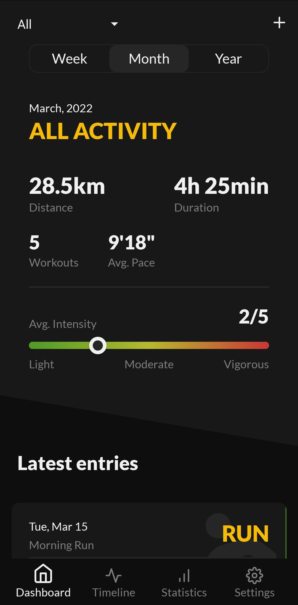
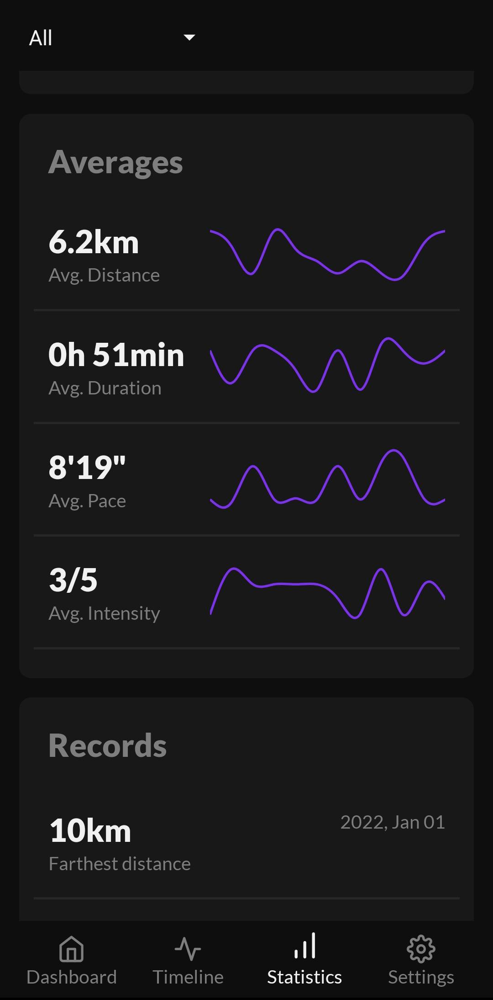
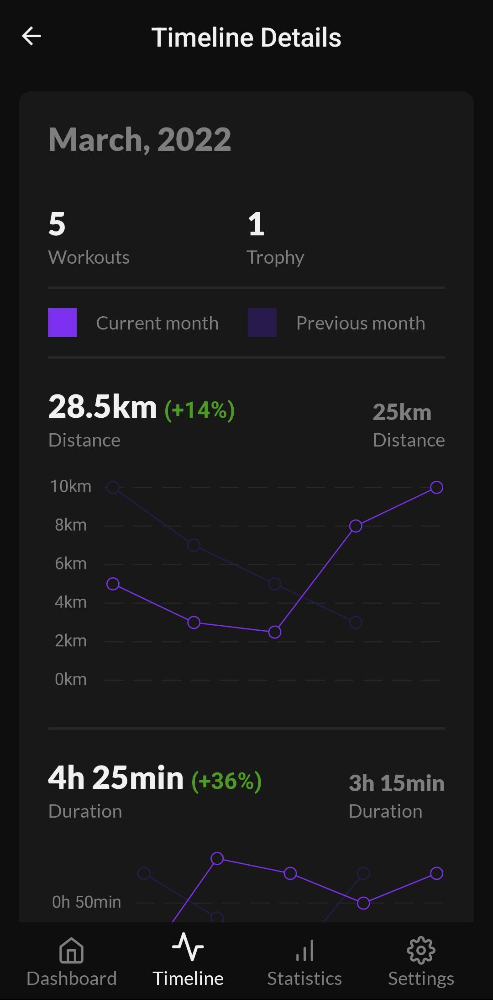
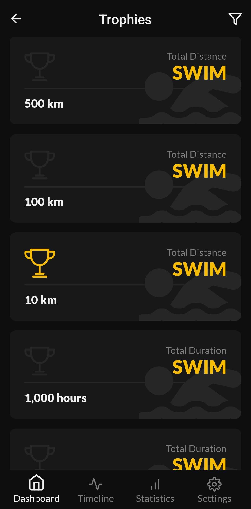

# Longurance

**Personal endurance training manual logging essentials.**

Keep track only of important things.

No account, no internet connection and no permissions required.

No unnecessary feeds or 'engaging' glitter.

Longurance is an offline, manual and easy to use endurance workouts logger for people who prefer to leave their phone aside.

Try it at <a href="https://play.google.com/store/apps/details?id=com.longurance.app" target="_blank">Google Play Store</a>.

 

    
    
    
    

## Overview

[//]: # (| Syntax                                           | Description | | |)

[//]: # (|--------------------------------------------------| ----------- | --- | --- )

[//]: # (| ![Dashboard]&#40;./screenshots/dashboard_screen.jpg&#41; | ![Dashboard]&#40;./screenshots/dashboard_screen.jpg&#41;       |  ![Dashboard]&#40;./screenshots/dashboard_screen.jpg&#41;  |  ![Dashboard]&#40;./screenshots/dashboard_screen.jpg&#41;  |)

[//]: # (![Dashboard]&#40;./screenshots/dashboard_screen.jpg&#41;)

[//]: # (![Timeline]&#40;./screenshots/timeline_details_screen.jpg&#41;)

[//]: # (![Statistics]&#40;./screenshots/statistics_screen.jpg&#41;)

[//]: # (![Trophies]&#40;./screenshots/trophies_list_screen.jpg&#41;)

App provides easy and quick way to enter your workout activity and get an overview of your overall progress. Currently three main activities are supported: running, swimming and cycling. Context between them can be changed at anytime in order to get only the insights which interests you at the time. Main attributes of workouts are title, date, distance, duration, effort, and notes. Every entered piece of data can be modified anytime. Alongside workout entries overview, filtering and statistics, there is a customizable trophy system to help you track your fitness goals.

Trophies are grouped into 2 types:

- Total
- Individual

Which are subdivided to 3 subtypes:

- Distance
- Duration
- Pace

## Features

### Dashboard screen

- Quick overview of current week/month/year
- New entry form
- New trophy form
- Latest entries widget
- Latest trophies widget
- All entries list with sorting options
- All trophies list with filtering options
- Individual entry details
- Individual trophy details

### Timeline screen

- Quick overview cards by month/year
- Timeframe details with charts and comparison with previous period

### Statistics screen

- Totals panel
- Averages panel
- Records panel

### Settings screen

- About section
- Import/Export to local filesystem for your created entries and trophies

## Tech stack

Created using React Native with Expo.
